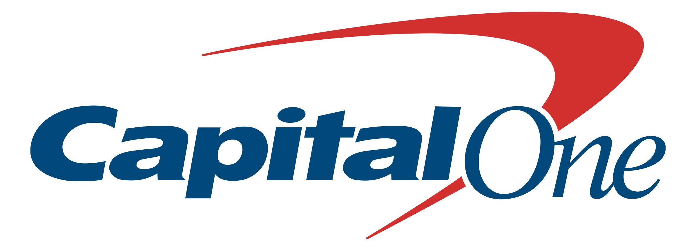

# Capital One Software Engineering Summit (Summer 2019)

Submission for CapitalOne's Mindsumo [challenge](https://www.mindsumo.com/contests/national-park-api) to Build a Web App that serves as a National Park Service Information Kiosk.

Website can be found [here.](https://www.nadinebrodriguez.com)

## Tech Stack
**Backend:**
- [Django](https://www.djangoproject.com/)

**Frontend:**
- HTML/CSS/JavaScript
- [jQuery](https://jquery.com/)
- [Bootstrap](https://getbootstrap.com/)

**Libraries and APIs**
- [National Park API](https://www.nps.gov/subjects/developer/api-documentation.htm#/) to present national park information
- [Requests](https://2.python-requests.org/en/master/) to parse JSON data
- [LeafletJS](https://leafletjs.com/) for rendering park map in javascript
- [Mapbox](https://www.mapbox.com/) for providing map resources

## Walkthrough
**Home Page**
 

**Results Page**
 

**Detail Page**
 

## Features Implemented
**Required:**
- [x] Filter
    - State
- [x] Search
    - Name
    - Keyword
- [x] List Details
    - Alerts
    - Articles
    - News Releases
    - Events
    - Places
    - Visitor centers
    - Campgrounds
    - Lesson plans
    - People

**Stretch:**
- [x] Map Visualizations
- [ ] NPS Relevant Symbols

## License 
Copyright 2019 Nadine Rodriguez

Licensed under the Apache License, Version 2.0 (the "License");
you may not use this file except in compliance with the License.
You may obtain a copy of the License at

http://www.apache.org/licenses/LICENSE-2.0

Unless required by applicable law or agreed to in writing, software
distributed under the License is distributed on an "AS IS" BASIS,
WITHOUT WARRANTIES OR CONDITIONS OF ANY KIND, either express or implied.
See the License for the specific language governing permissions and
limitations under the License.

